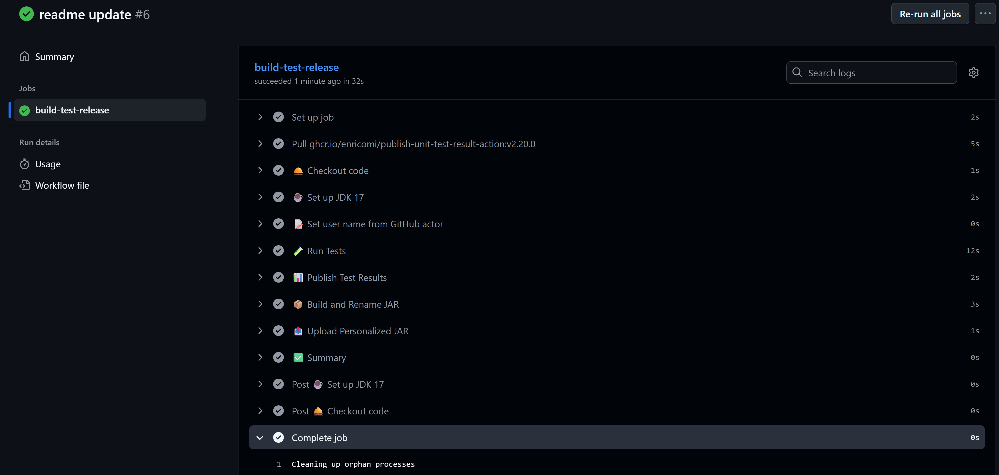

# 🧮 Calculator CI/CD Project (CC-SE)
I’ve created a new Git repository for you to practice **CI/CD workflows**, **Git collaboration**, and **unit testing** as part of your **group work**.

A collaborative Java calculator project where student groups implement their own calculator logic or simply implement other operations. All implementations are automatically tested, built, and packaged via **GitHub Actions CI/CD** (see `.github/workflows/cicd_workflow.yml`).

---

## 🎯 Goal
- Create group repo based on this one
- You will implement a concrete `Calculator` class or other math ops.
- Write Unit Tests for your code
- Your code will be **automatically tested** and **packaged into a JAR** named after your GitHub username.
- The CI/CD workflow `.github/workflows/cicd_workflow.yml` ensures correctness and simplifies submission.
- CI/CD workflow results are listed under actions menu
  
